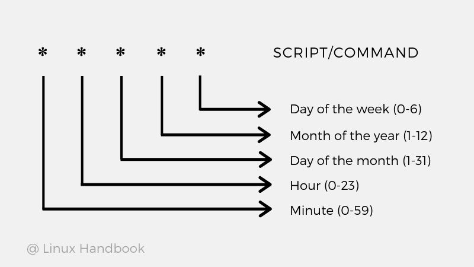

### Common Cron Expression Patterns

| Expression | Description |
|------------|-------------|
| 0 12 * * ? | Run at noon (12:00) every day |
| 0/15 0 * * ? | Run every 15 minutes every day |
| 1/2 0 * * ? | Run every odd minute |
| 0/5 13,18 * * ? | Run every five minutes, starting at 13:00 and ending at 13:55, and then starting at 18:00 and ending at 18:55, every day |
| 0-5 13 * * ? | Run every minute starting at 13:00 and ending at 13:05 every day |
| 15,45 13 ? 6 Tue | Run at 13:15 and 13:45 every Tuesday in June |
| 30 9 ? * MON-FRI | Run at 09:30 every Monday, Tuesday, Wednesday, Thursday and Friday |
| 30 9 15 * ? | Run at 09:30 on the 15th day of every month |
| 0 18 L * ? | Run at 18:00 on the last day of every month |
| 0 18 L-3 * ? | Run at 18:00 on the third to last day of every month |
| 30 10 ? * 5L | Run at 10:30 on the last Thursday of every month |
| 0 10 ? * 2#3 | Run at 10:00 on the third Monday of every month |
| 0 0 10/5 * ? | Run at 00:00 on every 5th day, starting from the 10th until the end of the month |

### Cron Special Characters

| Symbol | Description | Examples |
|--------|-------------|----------|
| * | For every time unit | '*' in the <minute> field means "for every minute" |
| ? | Used in the <day-of-month> and <day-of-week> fields to denote the arbitrary value | '?' in the <day-of-week> field means "any week day" |
| – | Determines the value range | 10-15 in the <hour> field means "between 10th and 15th hours" |
| , | Specifies multiple values | "MON, WED, FRI" in <day-of-week> field means on the days "Monday, Wednesday and Friday" |
| / | Defines the incremental values | "5/15" in the <minute> field means "5, 20, 35, and 50 minutes of an hour" |
| L | Used in the <day-of-month> and <day-of-week> fields, indicates the last day of the month or last occurrence | 'L' in <day-of-month> – the last day of the month 'L-3' in <day-of-month> – Third to last day '5L' in <day-of-week> – Last Friday |
| W | Used in the <day-of-month> field to specify the nearest weekday | "10W" in <day-of-month> – weekday near to 10th: - Saturday 10th → runs Friday 9th - Sunday 10th → runs Monday 11th - Weekday 10th → runs 10th |
| # | Specifies the "N-th" occurrence of a weekday of the month | "5#3" in <day-of-week> – Third Friday "1#2" in <day-of-week> – Second Monday |

### Cron Special Strings
In addition to the fields specified in the cron expression, there’s also support for some special, predefined values that we can use instead of the fields:

* @reboot – run once at system startup
* @yearly or @annualy – run once a year
* @monthly – run once a month
* @weekly – run once a week
* @daily or @midnight – run once a day
* @hourly – run hourly

### Working With Crontab
A cron schedule is a simple text file located under /var/spool/cron/crontabs on Linux systems. We cannot edit a crontab file directly, so we need to access it using the crontab -e command:

`crontab -e`

This opens the file for editing.

Each line in crontab is an entry with an expression and a command to run:

`* * * * * /usr/local/ispconfig/server/server.sh`

This entry runs the mentioned script every single minute.

### Common Cron Expression Patterns

### Cron Permissions
Ensure to set proper permissions for your system’s cron files to allow the jobs to run. You can create or edit two files to set the permissions – cron.allow and cron.deny.

If `/etc/cron.allow` exists, it should contain a username permitted to run the cron job automation. However, if your system has `/etc/cron.deny` containing a username, that account can’t use cron.

